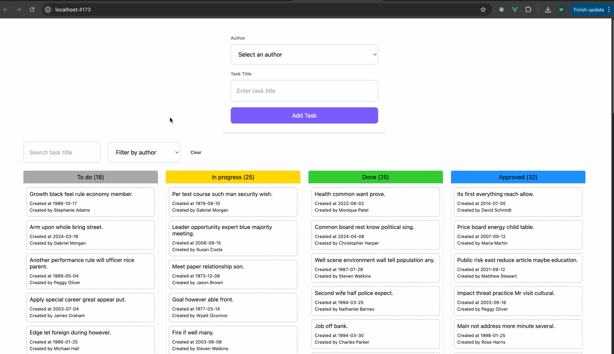

# Vue.js Kanban Board

## Preview

## Improvements

- Form validation;
- When task is dropped on a different column, display the task on top of the list;

## Available Scripts

- `yarn dev` - Start development server
- `yarn build` - Build for production
- `yarn preview` - Preview production build
- `yarn format` - Format code with Prettier

## Technologies Used

- Vue.js 3
- Pinia (State Management)
- Tailwind CSS
- Vite
- Axios
- UUID

## Features Implementation

### Task Management

- Tasks can be created with a title and author
- Tasks are organized in columns: "To do", "In Progress", "Done", and "Approved"
- Each task displays its title, creation date, and author

### Drag and Drop

- Tasks can be dragged between columns
- Visual feedback during drag operations
- Column highlighting when dragging over

### Filtering

- Filter tasks by title (search)
- Filter tasks by author
- Clear filters option

### State Management

- Centralized state management with Pinia
- Reactive updates for task movements
- Loading states for async operations
